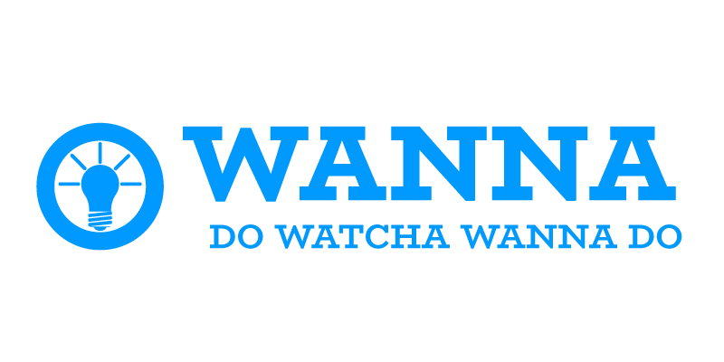

# Wanna

Wanna is an Anti-rugpull web 3.0 Crowdfunding Platform. Do Watcha Wanna Do!

  

## Problem

Global crowdfunding market is expected to grow from 12.4 billion dollars in 2019 to 23.1 billion dollars by 2026.

However, crowdfunding is difficult to manage continuously after funding, and there are many cases of embezzlement and bankruptcy. We created the Anti-Rugpull Web3 crowdfunding service 'Wanna' to solve this problem through blockchain.

### Solution

Investors earn project SBT and tokens to build an Investment DAO. Depending on the progress of the project, the DAO may receive a refund or continue to invest through governance procedures.

Projects that want to be invested upload project and team introduction, and set the funding amount. Projects with various topics such as games, daily necessities, ESG, and startups can be registered. The amount raised is locked up step by step through the governance voting process according to the implementation of the roadmap.

### Roadmap

We are planning to update three additional features in the future.

- Cypress Depoly
- Mobile: MetaMask, Klip Integration for mobile users
- P2P Market: Secondary P2P market to trade tokens
- Community: A community to discuss issues for Investment DAOs

### Built with

- react
- caver-js
- solidity
- mariaDB
- express(node-js)

### Contract Address (Baobab network)

- WannaFactory : 0xA86A8A55B04165022D010b7de052DB430F42c458
- WannaRouter : 0x30038D474125c00c19c56D4A567A0e865a48eFC6
- NFT (SBT, for launcher) : 0x3777C5F13b5f78f4e44775f1C6Eaa3e4C1FF9dd2 [view on opensea](https://testnets.opensea.io/collection/wanna-project)
- NFT (SBT, for sponsor) : 0x380101FC1Cb452Df51aa47c9991ad593a7913A1d [view on opensea](https://testnets.opensea.io/collection/wanna-sponsor)

### Link

[https://wannas.com](https://wannas.com/)
